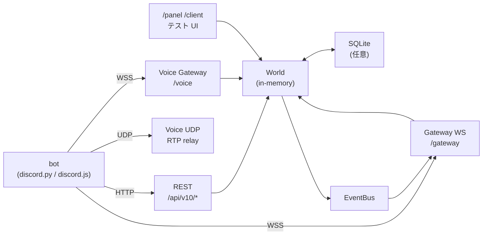

<div align="center">

# dapi-emu

### オフライン完結の Discord Bot API エミュレーター

[](https://www.python.org/)
[](https://fastapi.tiangolo.com/)
[](tests/)
[](LICENSE)

**`discord.py` も `discord.js` も無改造で繋がる、ローカル完結の bot 検証環境。**

---

</div>

## 概要

Discord 公式 API (v10) の REST / Gateway / Voice をローカルでエミュレートする FastAPI サーバー。Discord Developer Portal でアプリ登録せず、ネット接続もなしで bot の動作検証ができる。

- **REST**: 約 250 パスを実装（Channels / Guilds / Members / Roles / Threads / Webhooks / Interactions / OAuth2 / Stickers / Emojis / Stage / Scheduled Events / AutoMod / Polls / Audit Log / CDN ほか）
- **Gateway**: HELLO / IDENTIFY / Heartbeat / Resume / Sharding / zlib-stream / zstd-stream / ETF
- **Voice**: 制御 WS + UDP の RTP パススルー SFU
- **テスト用 UI**: Discord 風 3 カラムクライアント (`/client`) と管理パネル (`/panel`)
- **状態**: in-memory + 任意で SQLite 永続化、ロール/ギルドのプリセット保存・復元

## 特徴

| 項目 | 内容 |
|---|---|
| Interaction Workbench | Discord 風 UI から slash/button/modal を組み立てて bot に投げる → 応答を表示 → JSON テストケースに保存 → CLI/CI で再生 |
| 対応 bot ライブラリ | `discord.py` 2.x / `discord.js` 14.x（実機接続検証済み） |
| REST | 約 250 パス、`/api/v10` と `/api` 両プレフィックスでマウント |
| Gateway 圧縮 | 無圧縮 / zlib-stream / zstd-stream |
| Gateway encoding | json / ETF (erlpack 互換、pure-Python フォールバック内蔵) |
| マルチ bot 隔離 | bot ごとにギルド・DM・interaction を厳密フィルタ、混線なし |
| Voice | Gateway HELLO→READY→SELECT_PROTOCOL→SESSION_DESCRIPTION + UDP IP discovery + RTP 中継 |
| 永続化 | `DAPI_DB_PATH` で SQLite 化、5 秒ごとに autosave、再起動で完全復元 |
| プリセット | ユーザー / ギルド / ロール / チャンネル / メンバーを名前付きで save → load 一発復元 |
| OAuth2 | 認可 HTML 画面 → 承認 → リダイレクト + bot をギルドに自動追加 |
| CDN | アバター / アイコン / 絵文字を Pillow で動的生成（決定論的色 + イニシャル） |
| Audit Log | ロール / チャンネル / メンバー / Webhook 等の操作を 26 アクションで自動記録 |
| Rate Limit | `X-RateLimit-*` ヘッダ常時付与、`DAPI_ENFORCE_RATELIMIT=1` で実強制も可能 |
| システムメッセージ | メンバー参加 / ピン留め / スレッド作成 / ブースト / Stage 開始 等を自動投稿 |
| テスト | 135 件、すべて pass |

## アーキテクチャ



## インストール

```bash
git clone https://github.com/cUDGk/discord-api-emulator.git
cd discord-api-emulator
pip install -r requirements.txt
```

## 使い方

### 1. サーバー起動

```bash
python run.py
```

| URL | 用途 |
|---|---|
| `http://127.0.0.1:8080/` | ヘルスチェック |
| `http://127.0.0.1:8080/api/v10/...` | Discord 互換 REST |
| `ws://127.0.0.1:8080/gateway` | Gateway WS |
| `http://127.0.0.1:8080/panel` | 管理パネル |
| `http://127.0.0.1:8080/client` | Discord 風テストクライアント |
| `http://127.0.0.1:8080/workbench` | Interaction Workbench（slash/button/modal の試験・記録・再生） |
| `http://127.0.0.1:8080/docs` | Swagger UI |

### 2. Bot トークン発行（Developer Portal 不要）

```bash
curl -X POST http://127.0.0.1:8080/admin/users \
  -H 'Content-Type: application/json' \
  -d '{"username": "mybot", "bot": true}'
# → {"user": {...}, "application_id": "...", "token": "MTQ5N..."}
```

### 3. discord.py で接続

```python
import sys; sys.path.insert(0, "examples")
import patch_discordpy
patch_discordpy.apply()

import discord

intents = discord.Intents.default()
intents.message_content = True

class MyBot(discord.Client):
    async def on_ready(self):
        print(f"Logged in as {self.user}")

    async def on_message(self, msg):
        if msg.author == self.user:
            return
        if msg.content == "!ping":
            await msg.channel.send("pong!")

MyBot(intents=intents).run("<上で発行したトークン>")
```

### 4. discord.js v14 で接続

```javascript
const { Client, GatewayIntentBits } = require("discord.js");

const client = new Client({
  intents: [GatewayIntentBits.Guilds, GatewayIntentBits.GuildMessages],
  rest: { api: "http://127.0.0.1:8080/api" },
  ws: { compression: null },
});

client.once("ready", c => console.log("Logged in as", c.user.tag));
client.login("<上で発行したトークン>");
```

### 5. 永続化モード

```bash
DAPI_DB_PATH=./data/dev.db python run.py
```

`/admin/reset` でデータ初期化、再起動でも DB に保存された状態を復元。プリセットは reset しても残るので、テスト前の初期状態を `POST /admin/presets {"name": "myset"}` で保存しておくと一発復元できる。

### 6. テスト

```bash
python -m pytest tests/ -q
# 143 passed
```

### 7. Interaction Workbench

`http://127.0.0.1:8080/workbench` を開くと、登録済み slash command を選んで引数フォームから実行し、bot の応答を Discord 風吹き出しで確認できる。テストケースとして保存しておくと、CI で回帰テストできる:

```bash
# 1. 保存済みケースを一覧
python -m dapi_emu.workbench list

# 2. 1件だけ実行
python -m dapi_emu.workbench run testcases/ping-basic.json

# 3. 全件再生
python -m dapi_emu.workbench run --all
```

REST 経由でも操作可能:

| メソッド | パス | 用途 |
|---|---|---|
| POST | `/workbench/invoke` | interaction を組み立てて投げる |
| GET | `/workbench/testcases` | 保存済みケース一覧 |
| POST | `/workbench/testcases` | 現在の invoke 内容を保存 |
| POST | `/workbench/testcases/{name}/run` | 1件再生 |
| POST | `/workbench/run-all` | 全件再生してサマリーを返す |

## 実装スコープ

| ドメイン | 状態 |
|---|---|
| REST 約 250 パス | 完備 |
| Gateway (json/ETF + zlib/zstd + Resume + Sharding) | 完備 |
| Voice Gateway + UDP RTP 中継 | 完備（音声暗号化はパススルー） |
| Interactions (slash / button / modal / autocomplete + followup) | 完備 |
| OAuth2 (HTML 画面 + token 発行 + bot ギルド追加) | 完備 |
| CDN (動的画像 13 ルート) | 完備 |
| 永続化 (SQLite kv_store) | 完備 |
| プリセット save / load | 完備 |
| Audit Log 自動記録 | 26 アクション対応 |
| システムメッセージ自動投稿 | 20+ MessageType 対応 |
| Discord 風テスト UI | 完備 |
| Discord 公式 Opus codec デコード | 非対応（中継のみ。本物の Discord も復号しない） |

## ライセンス

[MIT License](LICENSE) — Copyright (c) 2026 cUDGk
